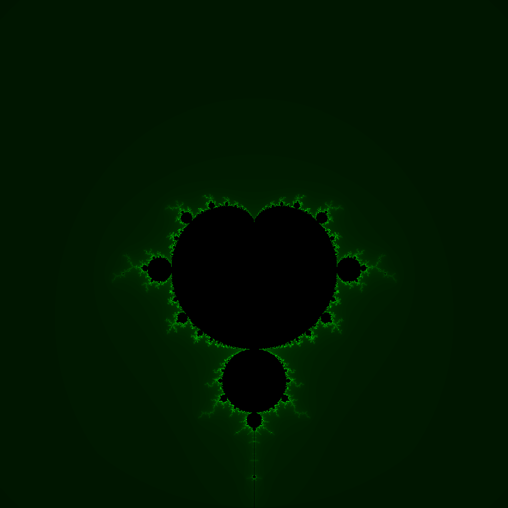

Overview
========
Creates a WIDTHxHEIGHT bitmapped image of the the [Mandelbrot set](http://en.wikipedia.org/wiki/Mandelbrot_set). The constanst WIDTH, and HEIGHT can be found in bitmap.h, and TOLERANCE can be found in mandelbrot.hpp. For each pixel, we scale it so that it is in the domain, and let (a,b) in [-2,2]x[-2,2], and then iterate the polynomial z^2+c where c is the imaginary number a+bi. After some number of iterations, either z^2+c >= 2 or the count > TOLERANCE. If it is greater than 2, the pixel diverges and we color it based on how quickly it diverged. Otherwise it is in the set, and colored black. An optional file name can be specified, if one is not supplied, the bitmap is named 'Mandelbrot.bmp'

Note
----
The code isn't optimized and takes some time to create the image. For a 1 megapixel image, it takes 6 seconds. Moving to 100 megapixel image the code takes about 10 minutes to generate the image.
Screenshot
==========

