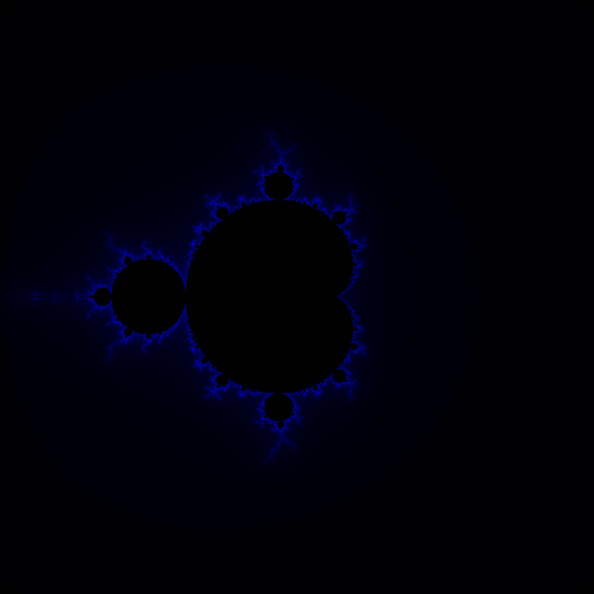

Calculates and draws a Mandelbrot set. The code isn't optimized and takes some time to create the image. For a 1 megapixel image, it takes 6 seconds. Moving to 100 megapixel image the code takes about 10 minutes to generate the image.

An optional file name can be specified, if one is not supplied, the bitmap is named 'Mandelbrot.bmp'

